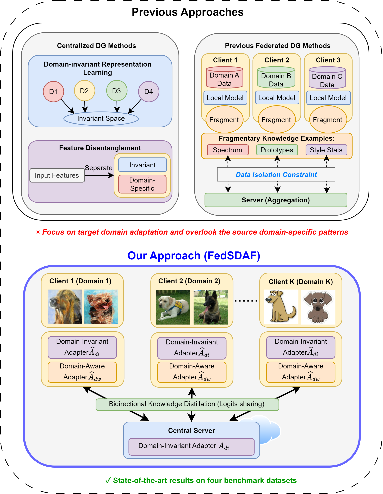

## Overview
FedSDAF is a novel federated learning framework addressing domain shift challenges in non-IID data scenarios.
<div align="center">
    
</div>

## Installation
Create and activate conda environment
```sh
conda create -n FedSDAF python=3.9.20
conda activate FedSDAF
pip install -r requirements.txt
```

## Datasets
[PACS](https://domaingeneralization.github.io/#data)

[OfficeHome](https://www.hemanthdv.org/officeHomeDataset.html)

[VLCS](https://github.com/belaalb/G2DM#download-vlcs)

[DomainNet](https://ai.bu.edu/M3SDA/)

Please put the datasets in the following directory structure:

```
├── datasets
│   ├── pacs
│   │   ├── raw_images
│   │   │   ├── art_painting
│   │   │   ├── cartoon
│   │   │   ├── photo
│   │   │   ├── sketch
│   │   ├── Train val splits and h5py files pre-read
│   ├── office_home
│   │   ├── Art
│   │   ├── Clipart
│   │   ├── Product
│   │   ├── Real_World
│   ├── vlcs
│   │   ├── Caltech101
│   │   ├── LabelMe
│   │   ├── SUN09
│   │   ├── VOC2007
│   ├── domain_net
│   │   ├── clipart
│   │   ├── infograph
│   │   ├── painting
│   │   ├── quickdraw
│   │   ├── real
│   │   ├── sketch
```

Then set the dataset locations in the configs.py.
```sh
# Set root directory (Please put the root directory here)
ROOT_DIR=
# set the dataset locations
cat > $ROOT_DIR/FedSDAF/configs/default.py <<EOF
pacs_path = '$ROOT_DIR/FedSDAF/datasets/pacs/'
officehome_path = '$ROOT_DIR/FedSDAF/datasets/office_home/'
log_count_path = '$ROOT_DIR/FedSDAF/log/'
vlcs_path = '$ROOT_DIR/FedSDAF/datasets/vlcs/'
EOF
```

Make label split for officehome and vlcs:
```sh
# Set root directory (Please put the root directory here)
ROOT_DIR=
# make label split for officehome and vlcs
python -u $ROOT_DIR/FedSDAF/data_loader/split_label.py \
    --root_path "$ROOT_DIR/FedSDAF/datasets/office_home" \
    --dataset 'officehome'
python -u $ROOT_DIR/FedSDAF/data_loader/split_label.py \
    --root_path "$ROOT_DIR/FedSDAF/datasets/vlcs" \
    --dataset 'vlcs'
```


## Run

```sh
# Train on PACS dataset
nohup python -u $ROOT_DIR/FedSDAF/train.py \
    --dataset pacs \
    --batch_size 128 \
    > $ROOT_DIR/FedSDAF/train_log/train_PACS.log 2>&1 &

# Train on OfficeHome dataset
nohup python -u $ROOT_DIR/FedSDAF/train.py \
    --dataset officehome \
    --batch_size 128 \
    > $ROOT_DIR/FedSDAF/train_log/train_OfficeHome.log 2>&1 &

# Train on VLCS dataset
nohup python -u $ROOT_DIR/FedSDAF/train.py \
    --dataset vlcs \
    --batch_size 64 \
    > $ROOT_DIR/FedSDAF/train_log/train_VLCS.log 2>&1 &

# Train on DomainNet dataset
nohup python -u $ROOT_DIR/FedSDAF/train.py \
    --dataset domainnet \
    --batch_size 1024 \
    > $ROOT_DIR/FedSDAF/train_log/train_DomainNet.log 2>&1 &
```
The log and checkpoints files will be saved in `log_count_path` in the configs.py.

## Acknowledgments 

Part of our code is borrowed from the repository [FedDG-GA](https://github.com/MediaBrain-SJTU/FedDG-GA). We thank them for sharing the code.


